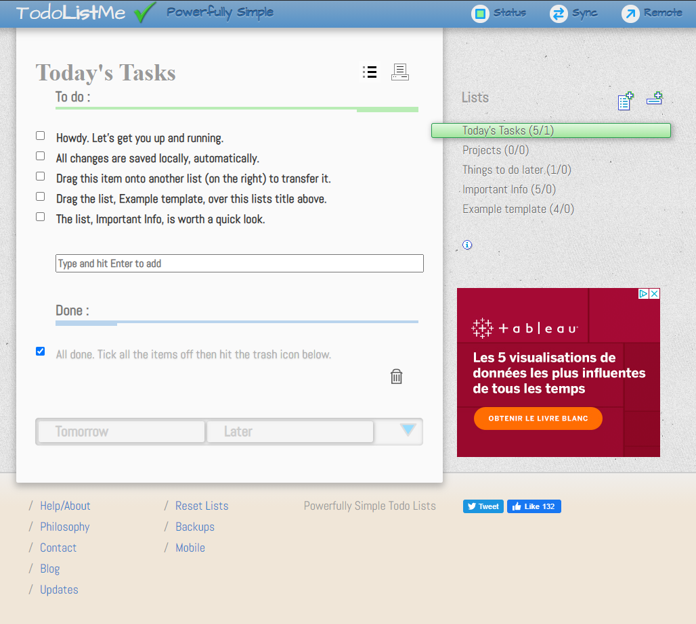
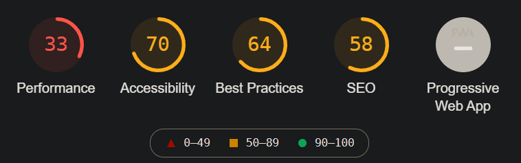
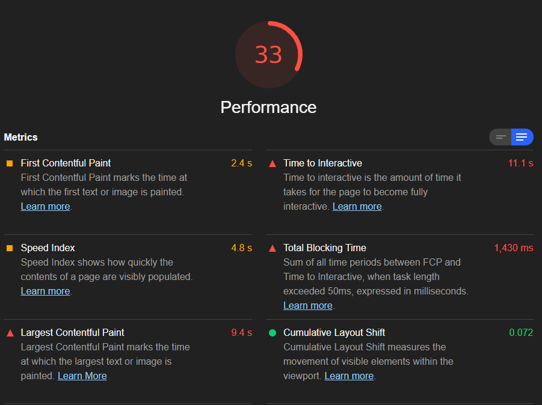
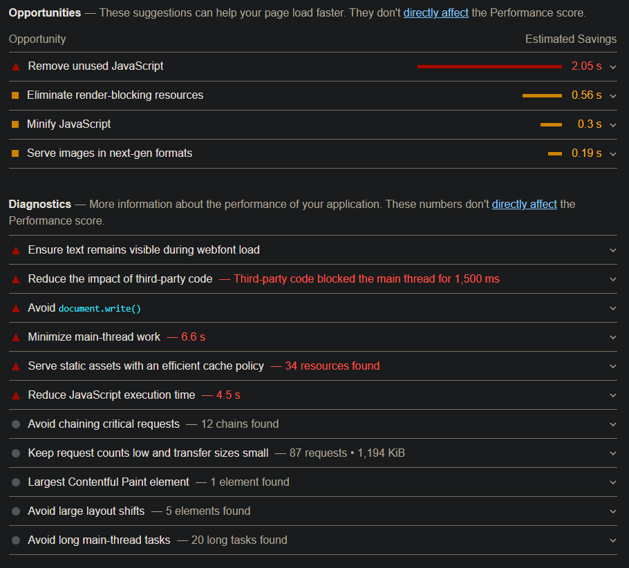
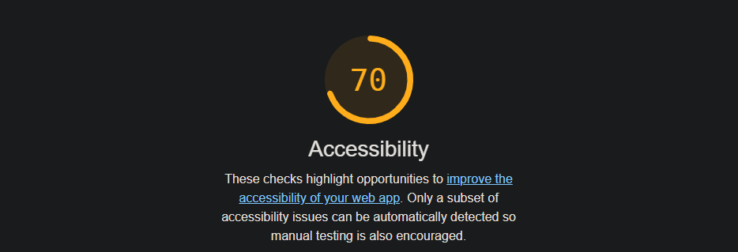
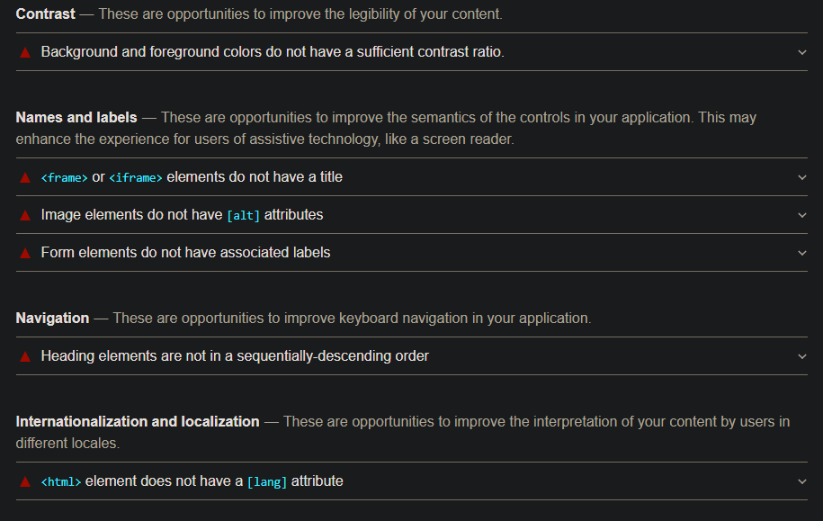
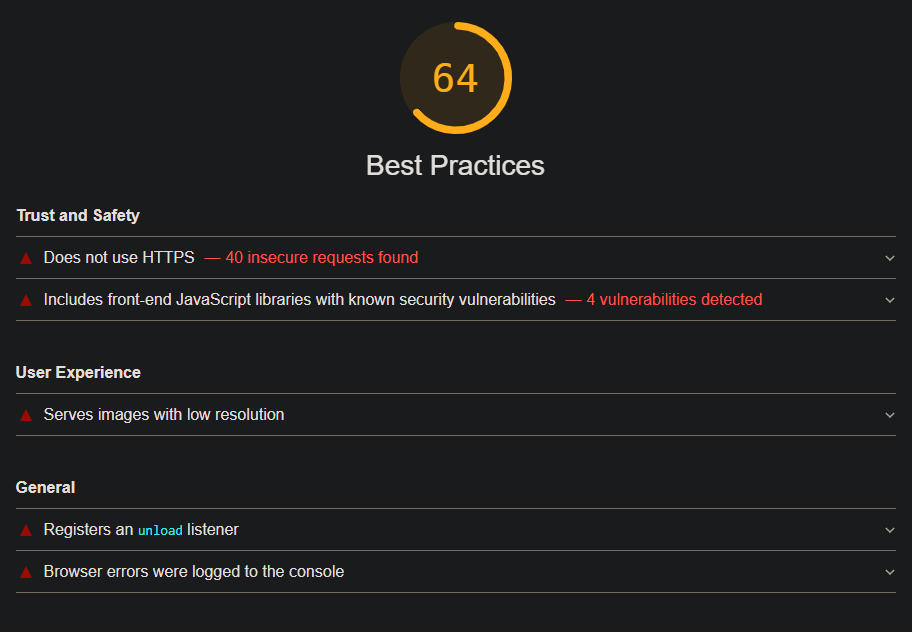
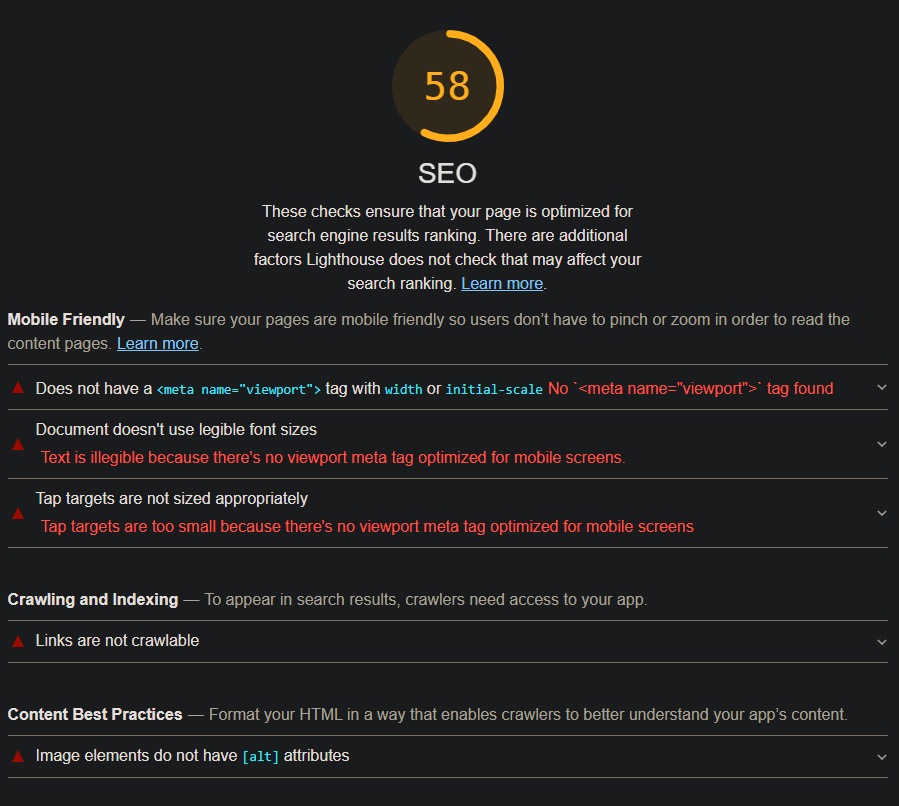

# Audit performance concurrent [TodoListMe.net](http://todolistme.net/)  
Avant d'envisager un éventuel "scaling" de notre application, nous avons réalisé un audit de performance d'un site concurrent ([TodoListMe.net](http://todolistme.net/)), 
afin d'identifier les points forts et les points faibles de celui-ci, et établir ainsi les axes d'améliorations possibles de notre application.  

  

## 1. Comparatif avec notre application:  
L'application [TodoListMe.net](http://todolistme.net/) présente les fonctions de bases de notre application, mais elle possède également des fonctionnalités plus poussées concernant:  
* La gestion des listes:  
    * Possibilité de créer plusieurs listes de tâches.
    * Possibilité de créer des catégories pour stocker les listes.
* Le tri possibles et l'ajout de temporalité sur les tâches:  
    * Possibilité d'assigner une date à une tâche.  
    * Possibilité de classer les tâches selon différents critères (alphabétiques, date, etc.).  
    * Système de drag and drop pour déplacer, planifier ou compléter une tâche.  
* l'utilisabilité de l'application:  
    * Barre de progression pour visualiser le nombre de tâches restantes et celles terminées.  
    * Version imprimable dans une nouvelle fenêtre avec une interface adaptée à l’impression.  
* La possibilité de synchroniser les données:  
    * Création d’un compte utilisateur (permet d’envoyer les listes sur un serveur et de les récupérer depuis un autre périphérique, avec une historique sur les listes de deux semaines).  
* Les réseaux sociaux et la publicité :  
    * Partage Twitter d’un lien vers le site.  
    * Bouton « like » de Facebook de la page de l’application.  
    * Publicité.  
## 2. Audit du site:  
Parmi les outils disponibles pour réaliser cet audit, celui-ci a été réalisé à l’aide de la console et de l’inspecteur du navigateur Chrome (Version Version 87.0, 64 bits) et de Lighthouse sur un ordinateur Windows 10.  

  

Les résultats globaux de performance du site sont de:  
* **33** sur 100 pour la performance.  
* **70** sur 100 pour l'accessibilité.  
* **64** sur 100 pour les bonnes pratiques.  
* **58** sur 100 pour l'optimisation SEO.  

### 2.1 Performance:  
  

Le mauvais score de la performance de cette application est en majeure partie du:  
* à un temps pour que la page soit entièrement intéractive de **11,1s**.
* à un indice de vitesse de **4,8s**, qui correspond à la vitesse à laquelle le contenu de la page est visiblement rempli.  
* à un first contentful paint de **2,4s**, qui correspond à l'affichage du premier élément sur la page.  

  

En analysant plus en détail ces critères de performance défaillants, nous constatons que:  
* des gains de temps pourraient être faits (**2,05s**) en optimisant le javascript non utilisé, notamment jQuery (fichier non minifié entre autre).  
* le chargement de la page est également ralenti par du code tiers (publicité, réseaux sociaux, etc.) qui bloque le thread principal lors du chargement. Il serait nécessaire de
limiter le nombre de fournisseurs tiers redondants, et d'essayer de charger ce code tiers une fois le chargement de la page terminé pour améliorer la performance.  
* d'une manière plus générale, des améliorations doivent être faite sur le **travail du thread principal**, notamment sur le report ou la suppression de trvail inutile.  
#### Audits de performance réussis (19):  
Plusieurs audits ont étés réussis sur ce critère, parmi lesquels:  
* Des images utilisés de bonnes tailles.
* Un temps de réponse initial du serveur court.
* Éviter de diffuser l'ancien JavaScript aux navigateurs modernes.  
* Évite les énormes charges utiles du réseau.  
* Évite une taille DOM excessive.  
* Évite les grandes bibliothèques JavaScript avec des alternatives plus petites.
* etc.
### 2.2 Accessibilité:  
  

De manière générale, lorsque nous disons qu'un site est accessible, nous voulons dire que le contenu du site est disponible et que ses fonctionnalités peuvent être exploitées par n'importe qui.  
Dans notre cas, le site de notre concurrent à un score d'accessibilté de **70** sur 100.  

  

Si nous regardons plus en détails les résultats de l'audit sur ce critère, les points à travailler sont:  
* Les couleurs d'arrière-plan et de premier plan n'ont pas un rapport de contraste suffisant.  
* Les éléments `<iframe>` n'ont pas de titre.  
* Les éléments images n'ont pas d'attribut `[alt]` .  
* Les éléments `<input>` n'ont pas d'éléments `<label>` associés.  
* Les éléments d'en-tête ne sont pas dans un ordre séquentiel décroissant.  
* La balise `<html>` de la page n'a pas d'attribut `[lang]`.  
#### Audits d'accessibilité réussis (13):  
Plusieurs audits ont étés réussis sur ce critère, parmi lesquels:  
* La page contient un en-tête, un lien de saut ou une région de référence.  
* Le document a un `<title>` élément.  
* Les attributs `[id]` des éléments actifs et focalisables sont uniques.  
* etc.
### 2.3 Bonnes pratiques:  
  

Nous constatons sur l'analyse de ce critère dont le score est de **64** sur 100, les éléments suivants:  
* Le site n'utilise pas **HTTPS**, ce qui constitue une faille de sécurité importante, même si le site n'utilise pas de données sensibles.  
* Le site utilise des bibliothèques JavaScript frontales avec des vulnérabilités de sécurité connues et notamment la bibliothèque **jQuery** dont la version non minifiée utilisée est **2.2.4** alors que la dernière version de cette bibliothèque est la version **3.5.1**.  
* Les images utilisées sont en basse résolution.  
* Des erreurs apparaissent dans la console. Les erreurs enregistrées dans la console indiquent des problèmes non résolus. Ils peuvent provenir d'échecs de requêtes réseau et d'autres problèmes de navigateur.  
#### Audits Bonnes pratiques réussis (11):  
Plusieurs audits ont étés réussis sur ce critère, parmi lesquels:  
* Les liens vers des destinations d'origine croisée sont sûrs.  
* Bibliothèques JavaScript détectées.  
* Le site évite les API obsolètes.  
* etc.
### 2.4 SEO:  
  

Nous constatons sur l'analyse de ce critère dont le score est de **58** sur 100, les éléments suivants:  
* Le site n'est pas adapté à l'utilisation sur appareil mobile.  
* Les éléments d'images n'ont pas d'attribut `[alt]`.
#### Audits SEO réussis (7):  
Plusieurs audits ont étés réussis sur ce critère, parmi lesquels:  
* Le document a un `<title>` élément.  
* Les liens ont un texte descriptif.  
* etc.  
  
## 3. Conclusion:  
### Bilan audit [TodoListMe.net](http://todolistme.net/):
A la vue de cet audit, nous pouvons déterminer les points forts et les points faibles de l'application concurrente.  
|         Points forts                            |         Points faibles                                             |
|-------------------------------------------------|--------------------------------------------------------------------|
| - Nombresuses fonctionnalités                   | - Performance de l'application                                     |
| - La synchronisation des tâches avec un serveur | - Les scripts tiers intervenants (publicité, réseaux sociaux, etc. |
| - Utilisabilité de l'application                | - Application non responsive, non PWA                              |
### Scaling éventuel de notre application:  
En tenant compte de ce bilan, nous pouvons donc établir les règles que devra suivre notre plan d'action "scaling de notre application", à savoir:  
* Implémenter d'autres fonctionnalités.  
* Rendre notre application responsive et plus mobile friendly.  
* Améliorer l’accessibilité (contraste, polices d’écriture, etc.).  
* Mettre à jour régulièrement et minifier jQuery.  
* Optimiser le code JavaScript.  
* Ne pas laisser des failles de sécurité (HTTPS, erreurs console, …).  
* Limiter le nombre de fournisseurs tiers redondants, et essayer de charger ce code tiers une fois le chargement de la page terminé pour améliorer la performance.  
* Optimiser les images.  
